# CineData API

CineData API adalah layanan Open API yang menyediakan metadata film
untuk aplikasi pihak ketiga, dengan sistem autentikasi berbasis JWT dan API Key.

## Fitur
- Admin & Developer Dashboard
- Manajemen katalog film (CRUD)
- API Key Management
- Public Movie API
- Logging & Rate Limiting

## Screenshots

### Landing Page
# 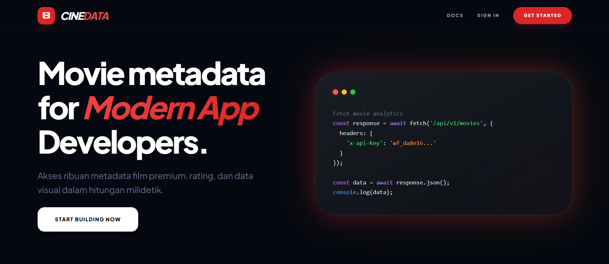
# 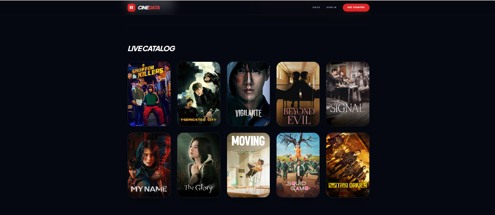
# 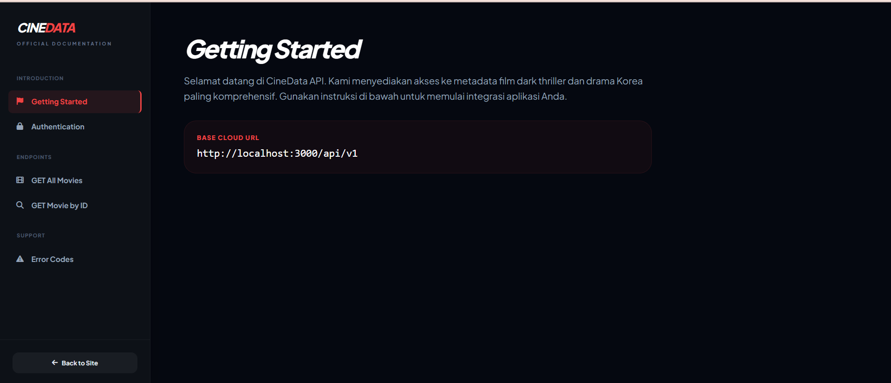
# 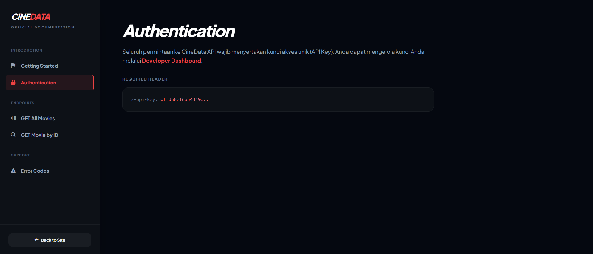
# 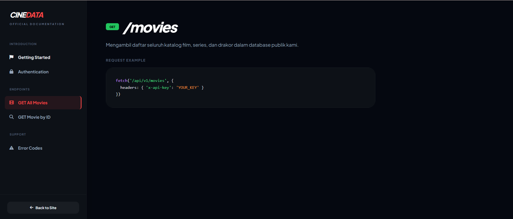
# 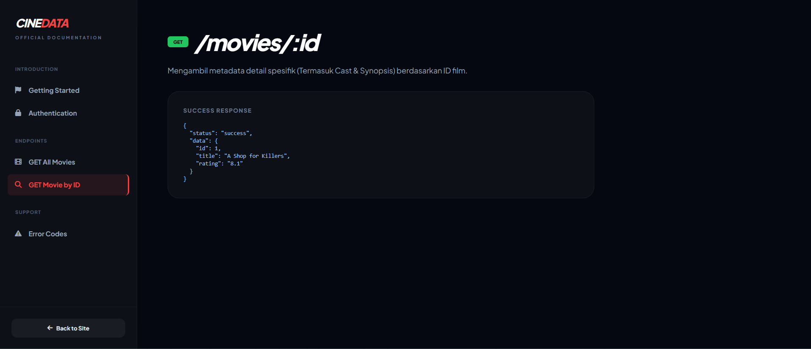

### Admin Hub (Management)
# 

# .png)
# 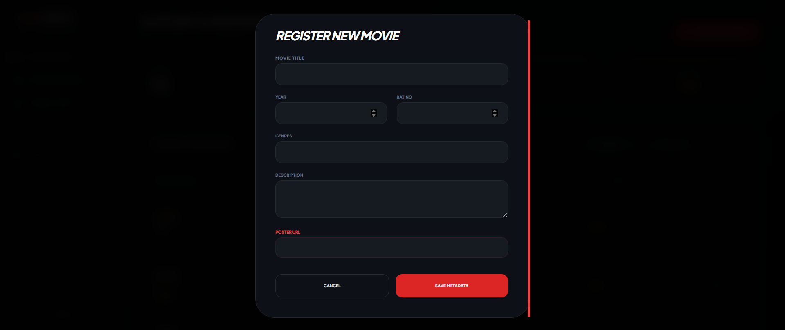
# 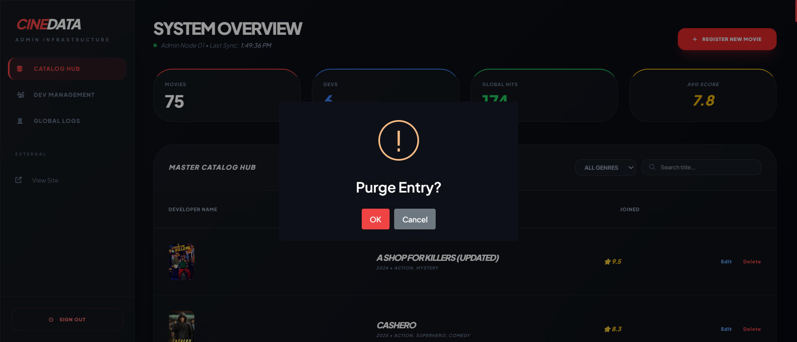
# 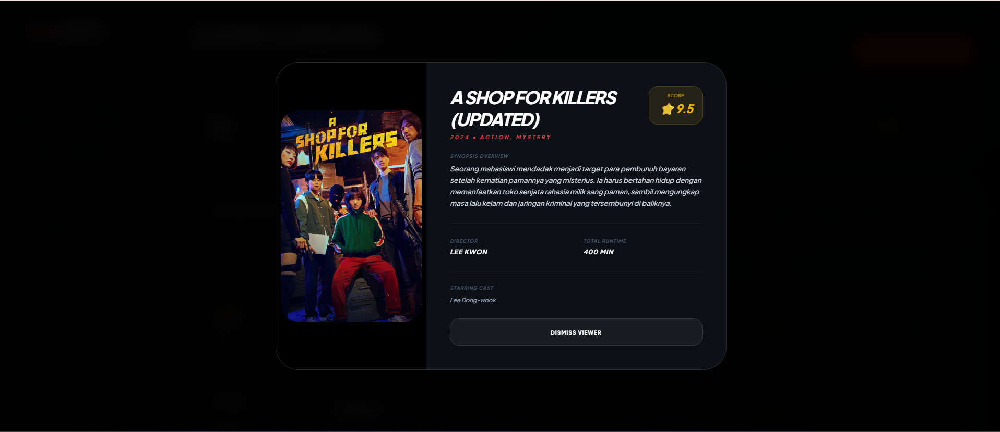
# 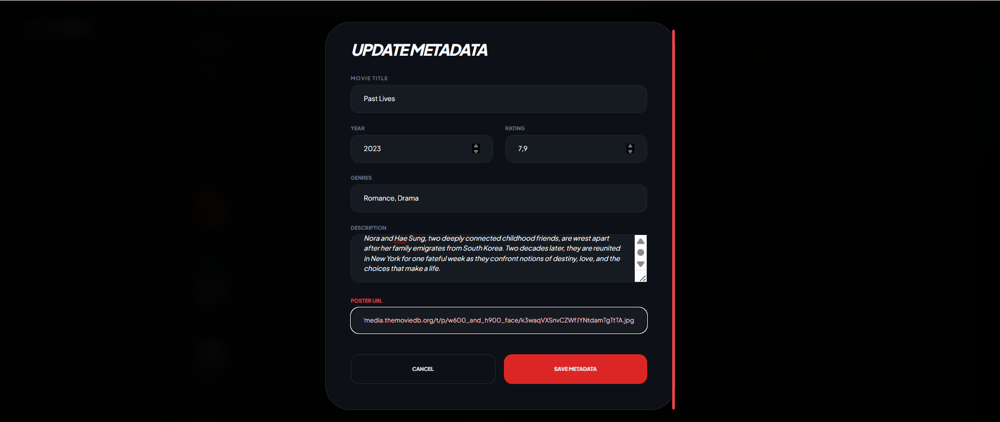
# 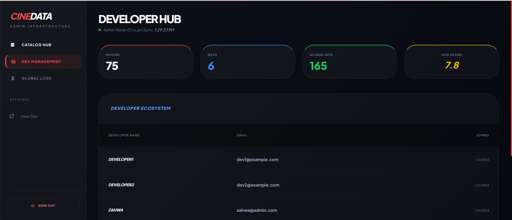
# 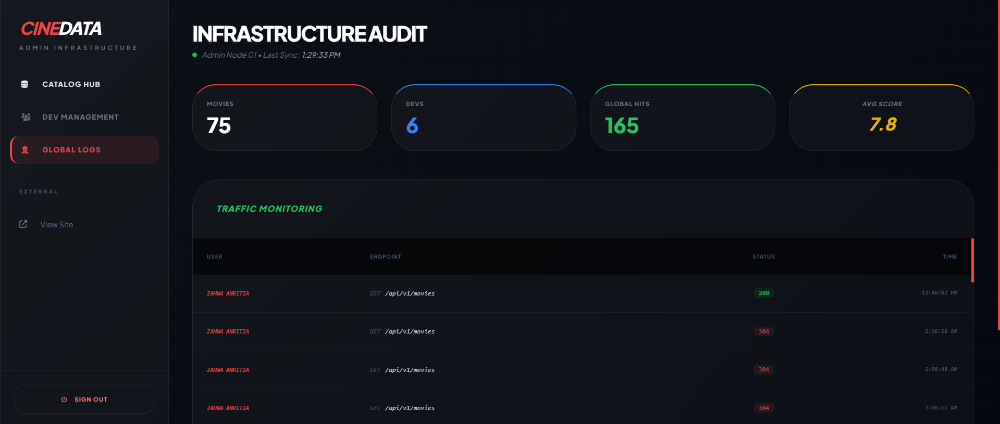

# 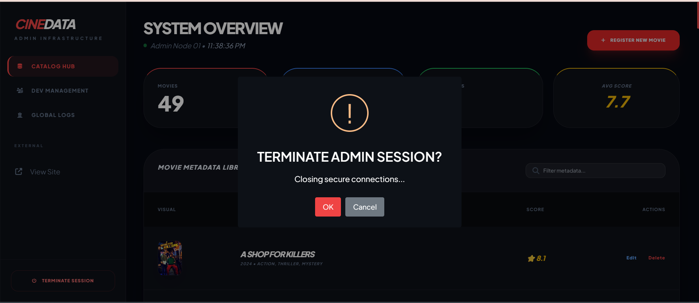

### Developer Console & Playground
# 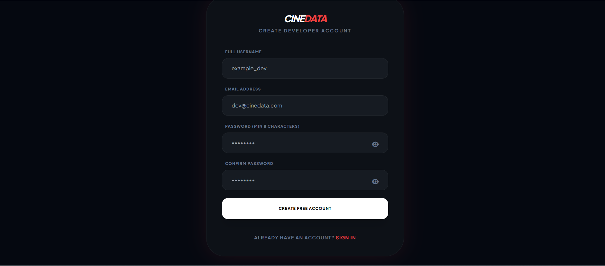
# 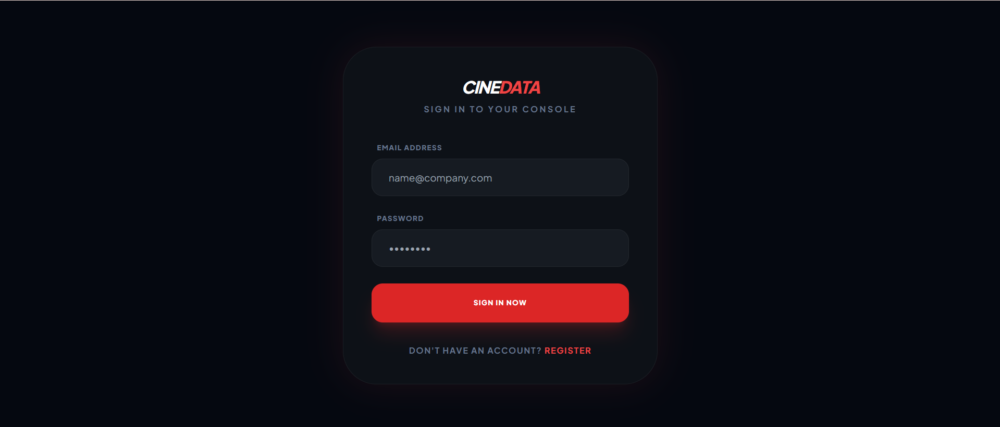

# 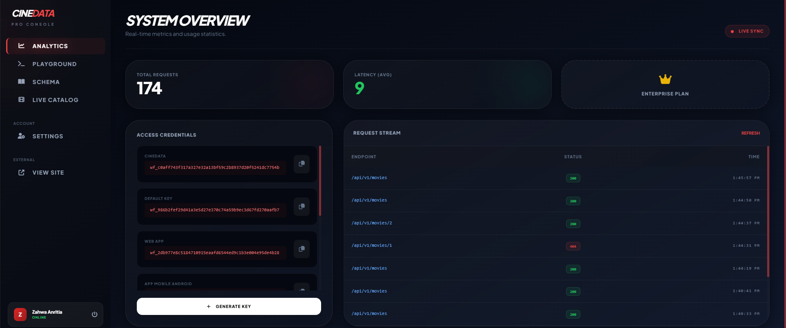
# 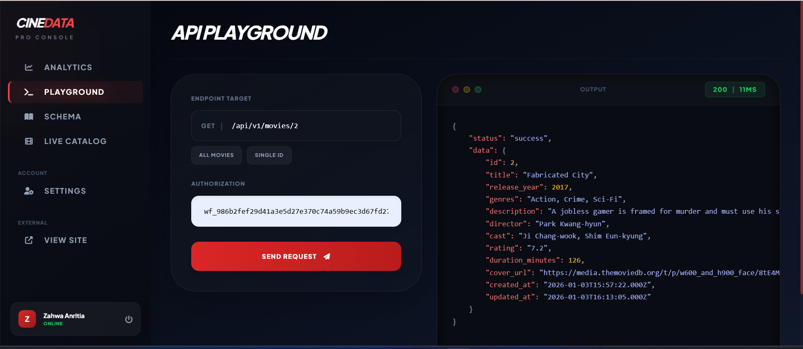
# 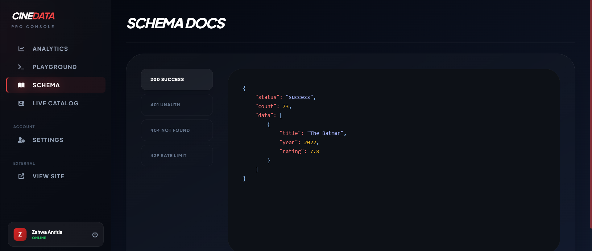
# 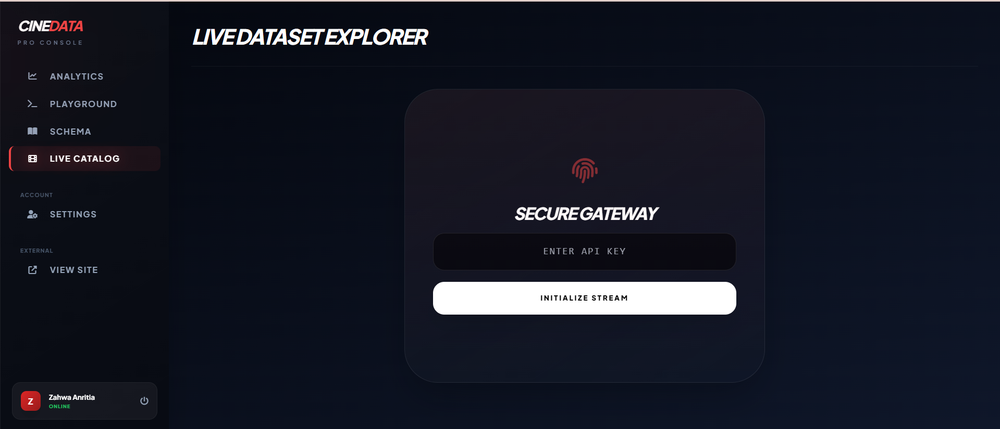
# 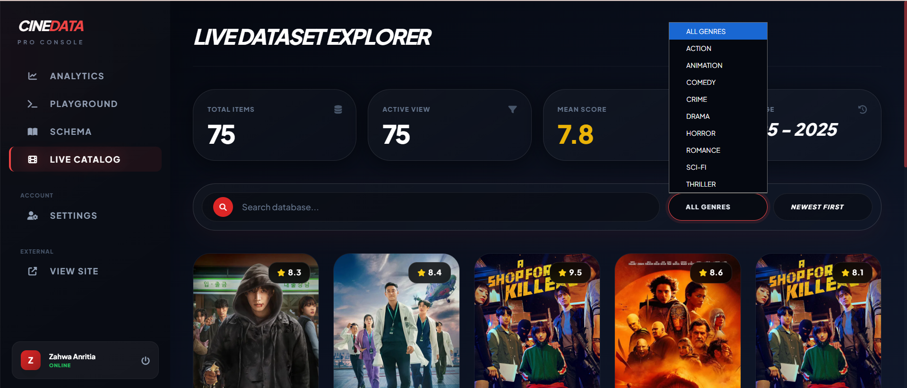
# 

# 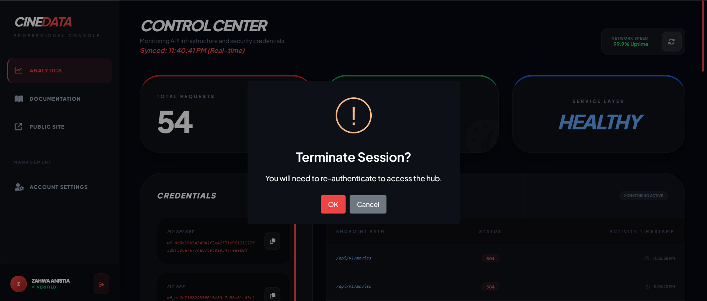

## Uji RateLimit
# 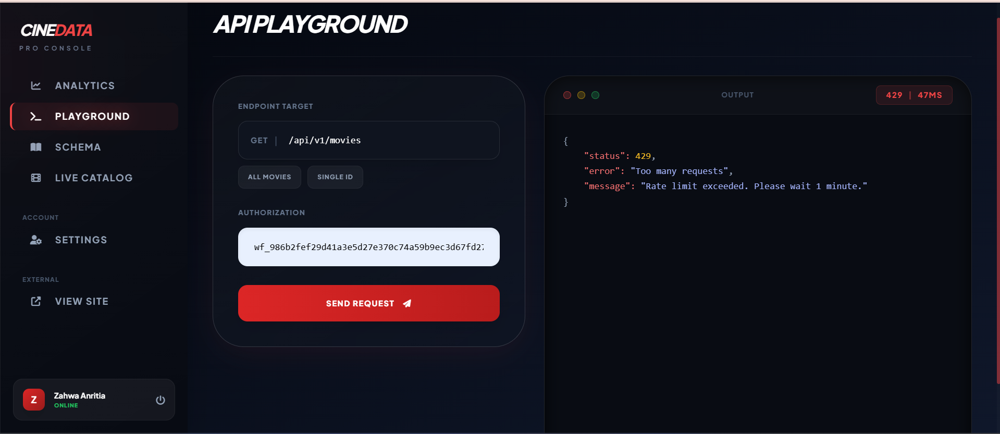