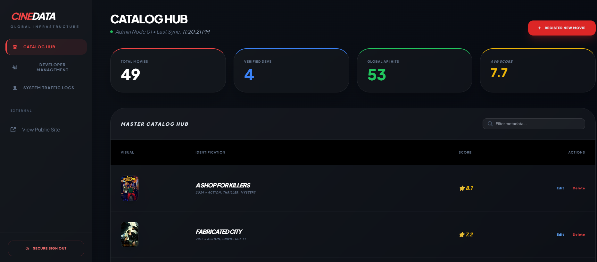
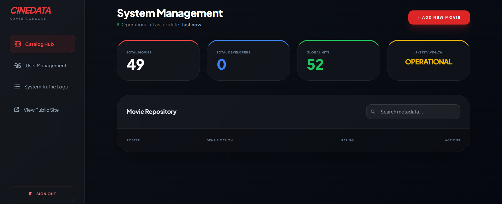
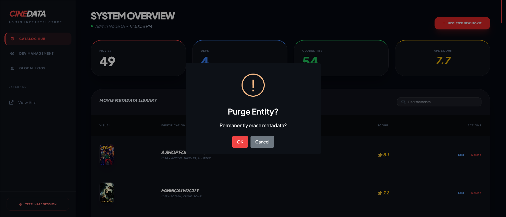
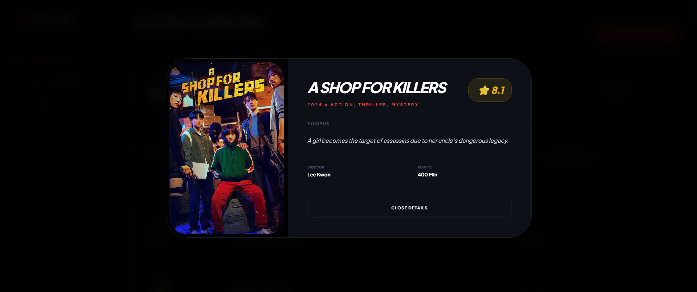
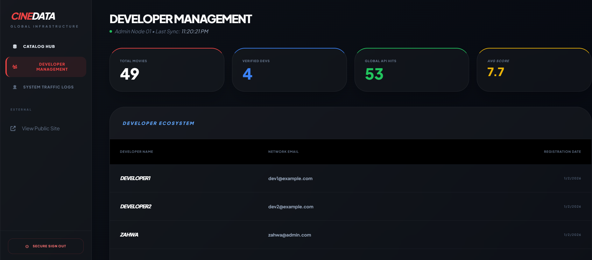
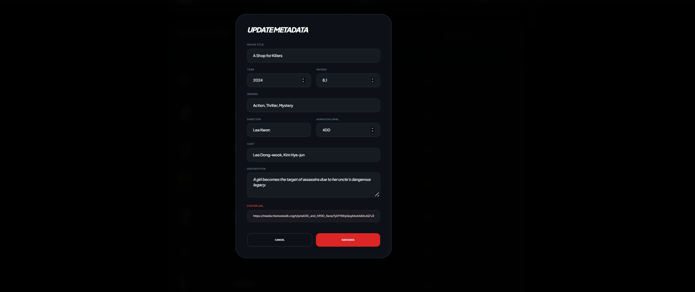
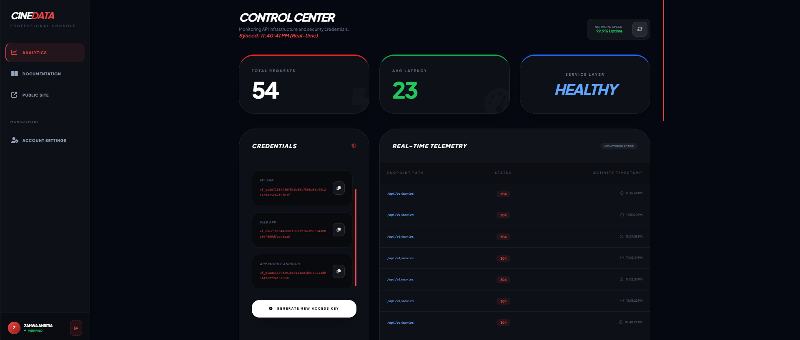
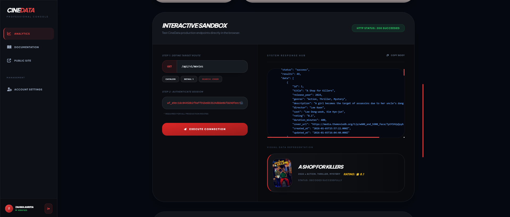
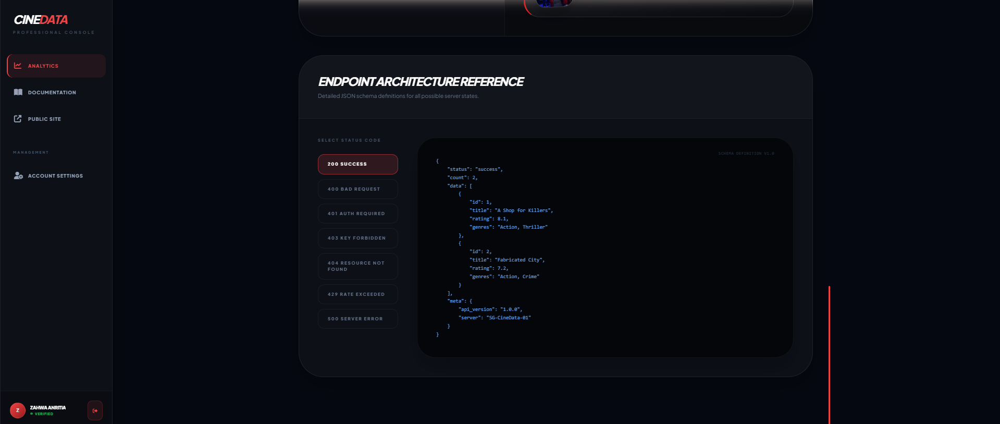
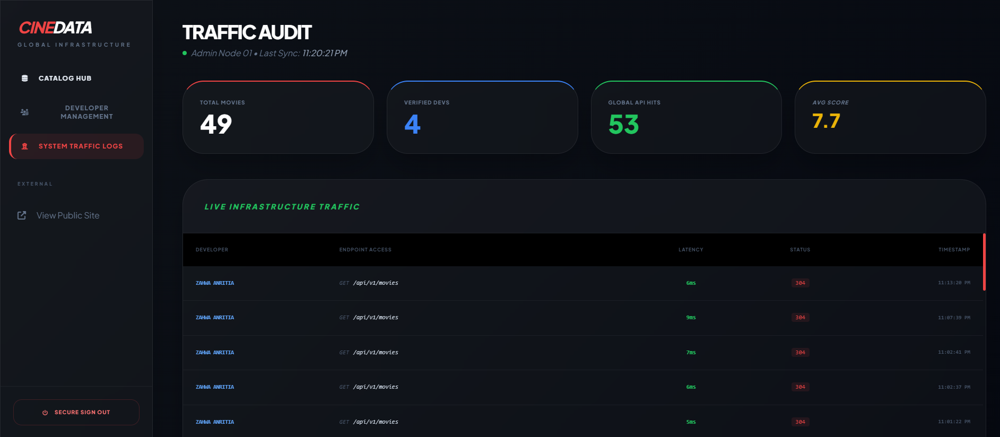

# CineData API - The Open Movie Metadata Hub

**CineData API** adalah platform Open API (SaaS Grade) yang menyediakan akses metadata film premium dengan spesialisasi pada genre **Dark Action, Thriller, Crime, dan Mystery**. Dibangun menggunakan arsitektur 3-Tier yang modern dan aman.

## Fitur Utama
- **Unified Red Dashboard**: Tema visual konsisten antara Admin dan Developer.
- **Admin Hub**: Manajemen katalog film (CRUD) lengkap dengan visual poster dan detail view.
- **Developer Console**: Manajemen multi-API Key, statistik penggunaan, dan analitik latensi.
- **Interactive Playground**: Uji coba endpoint API secara real-time langsung dari browser.
- **Telemetry System**: Pencatatan otomatis setiap aktivitas API (Logging) ke database.
- **Security**: Proteksi JWT untuk dashboard dan x-api-key untuk akses data publik.

## Tech Stack
- **Backend**: Node.js (V22), Express.js
- **Database**: MySQL 8.0
- **Frontend**: Tailwind CSS, SweetAlert2, FontAwesome 6
- **Authentication**: JSON Web Token (JWT) & API Key System

## Screenshots

### Landing Page

### Admin Hub (Management)

### Developer Console & Playground

